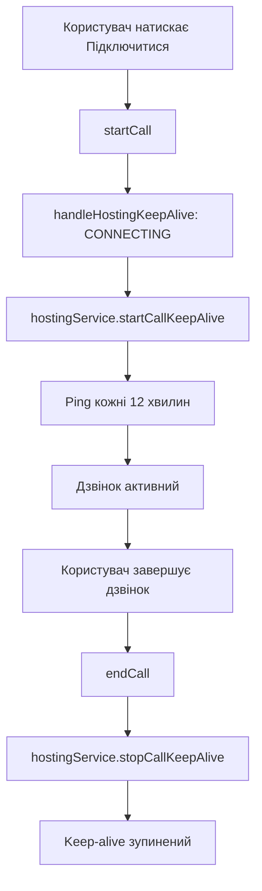

# 🏗️ Hosting Architecture для fam-connect

## 📖 Огляд

Додаток тепер підтримує **модульну архітектуру хостингу** з автоматичним **keep-alive механізмом** для запобігання засинанню сервера під час відеочатів.

## 🔧 Архітектура

### Структура файлів

```
src/app/services/hosting/
├── hosting-provider.interface.ts    # Загальний інтерфейс
├── render-hosting.service.ts        # Render-специфічна логіка
├── local-hosting.service.ts         # Локальна розробка
├── hosting-factory.service.ts       # Factory для вибору провайдера
└── hosting.service.ts              # Основний сервіс
```

### Принцип роботи

1. **Автоматичне визначення хостингу** - система самостійно визначає провайдера
2. **Keep-alive під час дзвінків** - запобігає засинанню сервера
3. **Модульність** - легко додати нових провайдерів
4. **Ізоляція логіки** - хостинг-специфічний код окремо від основного

## 🚀 Підтримувані хостинги

| Провайдер   | Статус         | Keep-alive     | Примітки        |
| ----------- | -------------- | -------------- | --------------- |
| **Render**  | ✅ Реалізовано | ✅ HTTP ping   | Основний target |
| **Local**   | ✅ Реалізовано | ❌ Не потрібен | Для розробки    |
| **Vercel**  | 🔄 Планується  | 🔄 Serverless  | Майбутнє        |
| **Railway** | 🔄 Планується  | ❌ Не засинає  | Майбутнє        |

## 🔄 Lifecycle keep-alive



## 💻 Використання в коді

### Автоматична ініціалізація

```typescript
// В video-call.component.ts
ngOnInit(): void {
  this.hostingService.initialize(); // Автоматично визначає провайдера
}
```

### Keep-alive управління

```typescript
// Автоматично керується на основі стану WebRTC
private handleHostingKeepAlive(state: ConnectionState): void {
  switch (state) {
    case ConnectionState.CONNECTING:
    case ConnectionState.WAITING:
      this.hostingService.startCallKeepAlive();
      break;
    case ConnectionState.DISCONNECTED:
    case ConnectionState.ERROR:
      this.hostingService.stopCallKeepAlive();
      break;
  }
}
```

## 🔧 Конфігурація

### Environment Detection

Система автоматично визначає хостинг на основі:

**Server-side:**

- `process.env.RENDER` → render
- `process.env.VERCEL` → vercel
- `process.env.RAILWAY_ENVIRONMENT` → railway

**Client-side:**

- `hostname.includes('.onrender.com')` → render
- `hostname === 'localhost'` → local

### Custom конфігурація

```typescript
// Можна перевизначити конфігурацію
this.hostingService.initialize({
  enabled: true,
  interval: 10 * 60 * 1000, // 10 хвилин
  serverUrl: 'https://custom-domain.com',
});
```

## 🏷️ Логування

Система надає детальне логування для відстеження:

```javascript
[HostingService] Ініціалізовано з провайдером: render
[render] Запуск keep-alive з інтервалом 12 хвилин
[render] Keep-alive ping успішний
[HostingService] Зупинка keep-alive після відеочату
```

## ➕ Додавання нового провайдера

1. **Створити сервіс** (наприклад, `vercel-hosting.service.ts`)
2. **Імплементувати інтерфейс** `HostingProvider`
3. **Додати в factory** (`hosting-factory.service.ts`)
4. **Оновити detection логіку**

```typescript
// vercel-hosting.service.ts
@Injectable({ providedIn: 'root' })
export class VercelHostingService implements HostingProvider {
  // Імплементація специфічна для Vercel
}
```

## 📊 Переваги архітектури

✅ **Модульність** - кожен провайдер ізольований  
✅ **Масштабованість** - легко додавати нових провайдерів  
✅ **Тестування** - можна мокати окремих провайдерів  
✅ **Підтримка** - зміни в одному провайдері не впливають на інші  
✅ **Автоматизація** - мінімум ручної конфігурації

## 📚 Файли для ознайомлення

- `DEPLOYMENT.md` - детальні інструкції деплою на Render
- `render.yaml` - конфігурація для автоматичного деплою
- `src/app/services/hosting/` - вся архітектура хостингу
